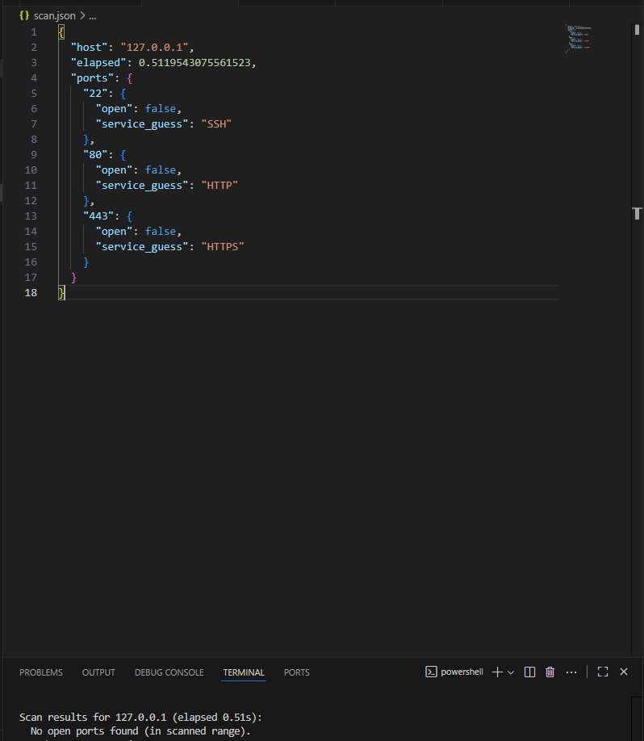

# PortScannerPro

A polite threaded TCP port scanner written in Python. Designed for learning and authorized testing only.

## Usage
```bash
python port_scanner.py --host 192.168.1.10 --ports 1-1024 --timeout 0.5 --workers 200 --json results.json


## Demo Screenshot

> Screenshot showing a completed localhost scan (`127.0.0.1`) using PortScannerPro.

